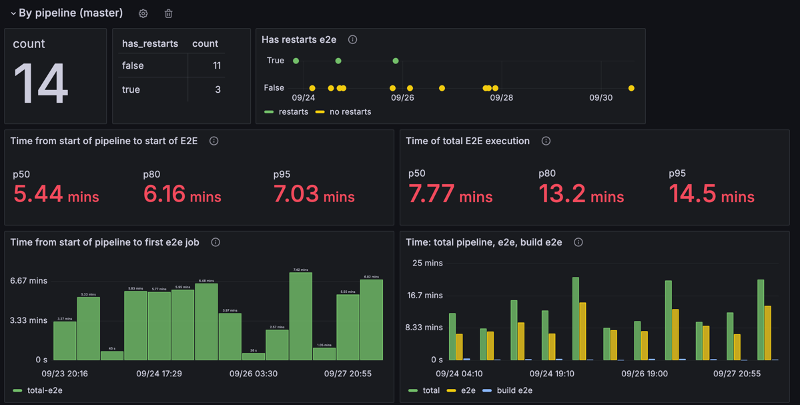

# pipeline-metrics-collector

- [Metrics Collector API](#metrics-collector-api)
- [Running & Updating](#running--updating)
- [Monitoring Metrics](#monitoring-metrics)

`pipeline-metrics-collector` is a Python-based application designed to collect pipeline metrics in database. 
It uses Flask for the web framework and SQLAlchemy for database interactions. 
The project is containerized using Docker and uses Alembic for database migrations.

## Metrics Collector API

**URL:** `/save_metrics`  
**Method:** `POST`  
**Content-Type:** `application/json`  
**Description:** This endpoint is used to save pipeline metrics.

**Request Body Example:**
```json
{
   "jobs": [
      {
         "name": "e2e",
         "started_at": "2023-06-13T14:12:33.677+07:00",
         "finished_at": "2023-06-13T14:13:01.293+07:00",
         "duration": 27,
         "up": 7,
         "e2e": 5
      }
   ],
    "builds": [
       {"build-e2e": 64}
    ],
    "build": 64,
    "created_at": "2023-06-13T14:11:24.029+07:00",
    "ref": "master",
    "duration": 97,
    "duration_e2e": 27,
    "jobs_failed": [],
    "has_restarts": false,
    "project": "test/project",
    "pipeline_id": 1
}
```

**Response:**
- **Status Code:** `200 OK` if metrics are saved successfully.
- **Status Code:** `208 Already Reported` if the pipeline metrics already exist.


## Running & Updating

1. Build and start the containers:
   ```sh
   docker-compose up --build
   ```
2. Initialize the database:
   ```sh
   docker exec -it pipeline-metrics-collector-web-1 sh 
   flask db upgrade
   ```

**Adding a new migration**
1. Uncomment the volume for migrations in docker-compose.yml: 
   ```yml
   volumes:
       - ./app:/app
       - ./migrations:/migrations
   ```
2. Start the containers
   ```shell
   docker-compose up
   ```
3. Create and apply a new migration
   ```shell
    docker exec -it pipeline-metrics-collector_web_1 sh
    flask db migrate -m 'migration'
    flask db upgrade <revision>
   ```
   
## Monitoring metrics

One way of monitoring the metrics is to use grafana



### Some SQL queries

- [Pipelines Count](#pipelines-count)
- [Time from Start of Pipeline to Start of E2E](#time-from-start-of-pipeline-to-start-of-e2e)
- [Time of Total E2E Execution](#time-of-total-e2e-execution)

#### Pipelines count

```sql
SELECT count(*)
FROM metrics_pipeline mp
WHERE
  $__timeFilter(created_at) AND
  mp.project = '$project' AND mp.is_master = true
```

#### Time from start of pipeline to start of E2E

```sql
SELECT 
  PERCENTILE_CONT(0.5) WITHIN GROUP(ORDER by total) as p50, 
  PERCENTILE_CONT(0.80) WITHIN GROUP(ORDER by total) as p80,
  PERCENTILE_CONT(0.95) WITHIN GROUP(ORDER by total) as p95
FROM (SELECT
  created_at AS "time", 
  mp.duration - mp.duration_e2e as "total"
FROM metrics_pipeline mp
LEFT JOIN metrics_build mb
ON mb.pipeline_id = mp.pipeline_id
WHERE
  $__timeFilter(created_at) AND
  mp.project = '$project' AND mp.is_master = true
GROUP BY time, mp.duration, mp.duration_e2e
ORDER BY 1) as data
```

#### Time of total E2E execution

```sql
SELECT 
  PERCENTILE_CONT(0.5) WITHIN GROUP(ORDER by total_e2e) as p50, 
  PERCENTILE_CONT(0.80) WITHIN GROUP(ORDER by total_e2e) as p80,
  PERCENTILE_CONT(0.95) WITHIN GROUP(ORDER by total_e2e) as p95
FROM (SELECT
  created_at AS "time", 
  mp.duration_e2e as "total_e2e"
FROM metrics_pipeline mp
LEFT JOIN metrics_build mb
ON mb.pipeline_id = mp.pipeline_id
WHERE
  $__timeFilter(created_at) AND
  mp.project = '$project' AND mp.is_master = true AND mp.has_restarts = false
GROUP BY time, mp.duration, mp.duration_e2e
ORDER BY 1) as data
```